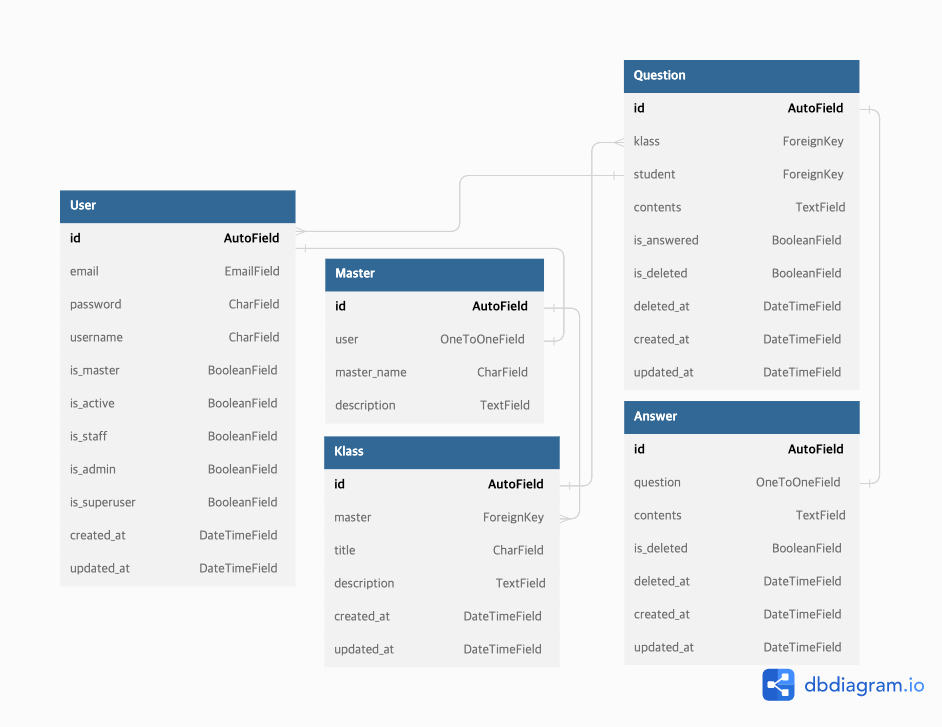

# 프로젝트 개요

* 큐리어슬리에서 서비스 중인 에어클레스의 일부 서비스를 구현합니다.

* 에어클레스는 수강생이 강의를 구매하는 기능, 강의에 질문을 남기는 기능, 질문에 답변을 남기는 기능 등이 있습니다.
  

# 요구사항

* 수강생, 강사, 강의, 질문, 답변 모델 간의 관계를 구현해야 합니다.

* 강의 생성
  * 강의(Klass)는 강사(Master)만 생성할 수 있습니다.

* 질문 생성
  * 유저는 모든 강의에 질문을 남길 수 있습니다.
  * 작성한 질문은 삭제할 수 있습니다.
  * 답변이 달린 질문은 삭제할 수 없습니다.

* 답변 생성
  * 강사는 자신이 개설한 모든 강의에 달린 질문에 답변을 할 수 있습니다.

* 질문, 답변 확인
  * 모든 사용자는 모든 질문과 답변을 확인할 수 있습니다.

# 제약 사항

* Language : Python3
* Framework : Django, DjangoRestFramework
* SQL

***
# 기술스택

* `python 3.8`, `Django 3.1`,`DRF 3.13`
* `SQLite`
* `DRF simplejwt`

# ERD
  

# 실행 방법

* 본 프로젝트는 Python 3.8 버전에서 작성되었습니다. 해당 버전 이상의 환경에서 실행하는 것을 권장합니다.

1. Github에서 해당 프로젝트를 내려 받습니다.

`git clone https://github.com/gshduet/air_klass_mission.git`

2. 서버 구동에 필요한 패키지를 내려받기 위해 디렉토리를 이동합니다.

`cd air_klass_mission/djangomission`

3. requirements.txt을 통해 패키지를 내려 받습니다.
>현재 위치는 ./air_klass_mission/djangomission이어야 합니다.

`pip3 install -r requirements.txt`

4. DB 스키마 동기화를 위해 migration을 진행합니다.

`pytohn manage.py migrate`

5. 서버를 구동합니다.

`python manage.py runserver 0:8000`

> 본래 서버 구동 시 DB 커넥트에 관한 정보, `SECRET_KEY` 와 같은 민감한 정보들은 환경변수 설정 혹은 은닉화한 별도의 파일을 통해 관리하는 것이나 제출의 편의성을 위해 해당 정보들을 담은 `my_settings.py` 파일 역시 GitHub에 업로드 하였습니다.

# 최종 구현범위

## 구현완료
* 유저, 강사, 강의, 질문, 답변 모델 정의
* 회원가입, 로그인 기능
* 강사 지정/해제 기능
* 강의 개설, 조회
* 강의 상세정보 조회, 수정
* 질문 생성, 질문 리스트 조회
* 질문 상세정보 조회, 수정, 삭제

## 구현 중
* 답변 생성, 조회, 수정, 삭제
  * 답변 리스트 조회

# API 명세서
[Postman Document](https://documenter.getpostman.com/view/18212355/2s83tGmWVN)

# 구현 실패 사항 회고

## 인증/인가 기능
### `djangorestframework-simplejwt`를 비롯한 인증/인가 프로세스 숙지 미숙으로 인한 유저 인증/인가 실패

* 인증/인가 관련해 서비스에 적용할 수 있을법한 수준의 작업을 해본 경험이 없음. 

  * 세션을 통한 인증과 토큰을 통한 인증의 차이점에 대해 이론적으로만 알고 있음.

  * Django에서 각각의 인증 어떤 차이를 갖는지, 실제 구동 과정은 어땠는지에 대한 학습이 부족했음 
  * 이로인해 `request` 안에 인증을 마친 유저의 정보를 담는 것에 대한 프로세스를 충분히 고려하지 못했고 인증/인가에 실패함

1. `djangorestframework-simplejwt`을 바탕으로 한 인증/인가를 구현하려 시도했으나 해당 라이브러리 자체에 대한 숙련도 이슈와 인증/인가 작업 자체에 대한 숙련도 이슈 두 가지가 겹쳐 많은 시간을 소모하게 됐습니다.  
2. 원래 의도했던 것은 로그인(인증)이 완료된 후  `request.user`안에 담긴 User객체를 통해 인증 여부를 확인하고 이를 통해 CustomPermission을 제작하고 인가를 담당하려 했습니다.   
3. 그러나 JWT를 통한 인증/인가의 경우 쿠키에 세션데이터가 담기지 않아 인증되지 않은 유저로 판단하고 `request.user` 내부에 `AnonymousUser` 값이 들어 감을 뒤늦게 파악했습니다. 이때가 10월 1일 오후 10시경이었습니다.  
4. 뒤늦게 해당 이슈를 해결해보려 했으나 시간이 부족할 것이라 판단하고 로그인 시 쿠키에 User 자체에 대한 정보 중 일부(User의 Unique id)를 담아 인증과 인가를 구현했습니다.
   * 이 외에도 
      ∙ simplejwt 대신 drf에서 제공하는 자체 authentication을 사용하는 법 
      ∙ 인가가 필요할 때마다 쿠키에 첨부 된 access_token을 decoding하여 user_id를 파싱하는 법 
등을 구상했으나 이 역시 시간이 부족한 이유로 지금의 방법을 선택했습니다.
  
5. 구현 과정은 다음과 같습니다. 
 1. 유저가 로그인 시 해당 유저의 id(primary_key)를 쿠키에 담아 응답합니다. 2. 이후 인가가 필요한 API 구현 시 request에서 쿠키를 파싱해 유저의 id를 받아오고 이를 통해 User DB를 히트해 해당 유저의 정보를 불러옴  

6. 결과적으로 쿠키에 user_id를 담아 해당 정보를 토대로 인가하는 방법을 통해 일부 기능을 구현하는 것엔 성공했으나 다음 요소들이 불안요소로 작용하고 있습니다.
    1. 누구나 오픈할 수 있는 쿠키에 유저의 정보를 담는 것이 보안상 위험요소로 존재하는 점  
    2. 필요할 때마다 데이터베이스를 히트해 유저의 정보를 불러오는 과정에서 쓰지 않아도 되는 자원을 낭비하는 점
